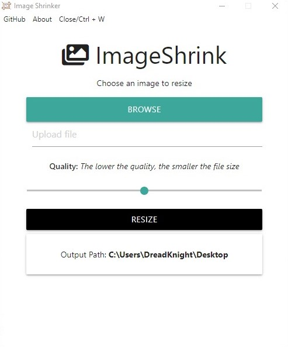

  <p align="center">
    <a href="">
      
    </a>
  </p>
  <h1 align="center">ImageShrink</h1>


  <div align="center"> 
  ✔ build ✔ Test
  A small desktop tool built on Electron for minimizing images.
  </div>

  ### Download

  you can download the zip file from [here](https://drive.google.com/file/d/10JtmwFYZldRW8SRe5fUj67J3Lv87SOMN/view?usp=sharing).

  or you can clone the project 
  ```
  git clone  https://github.com/ooeid/ImageShrink.git
  ```

  change to the project folder 
  ```
  cd img-shrinker
  ```
  install dependencies
  ```
  - npm install
  ``` 
  start :)
  ```
  npm start 
  ```

